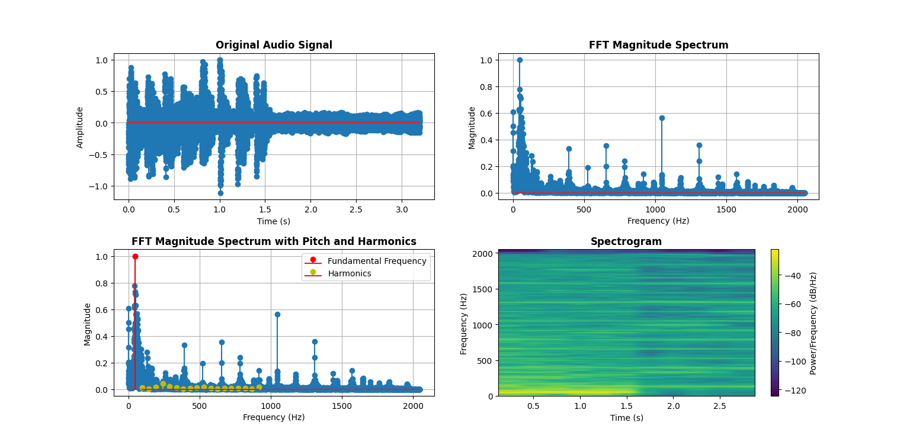

# Finding_Pitch_and_Harmonics_and_Noise_Analysis_using_FFT_and_Spectrogram_of_an_Audio_Signal

You can find pitch and harmonics  and analysis noise of any audio file located in your computer.

### Importants:
- Use small length of the audio file. Best if length is 3 to 6 seconds. Because here are samples equal to sample rate per seconds. Generally sample rate is a large number.
- You may need to wait some times for output if the audio file or sample rate is large.
- The sample rate may need to change according to the different audio signal.

### Analysis Diagrams

